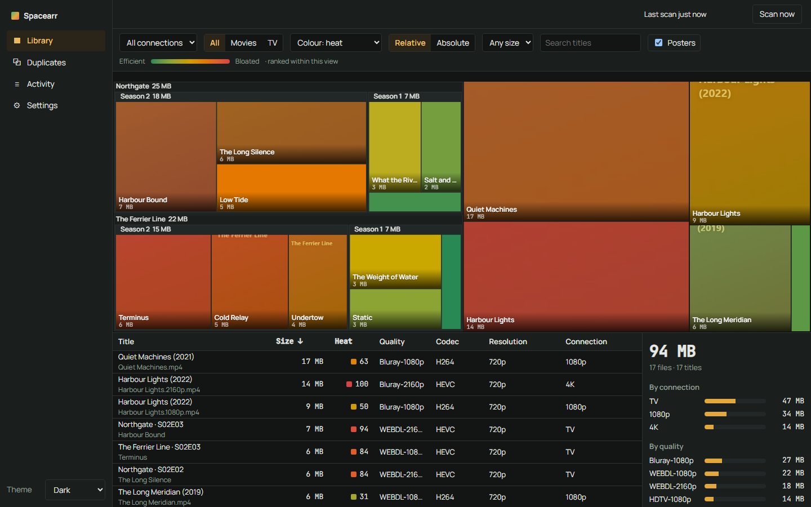
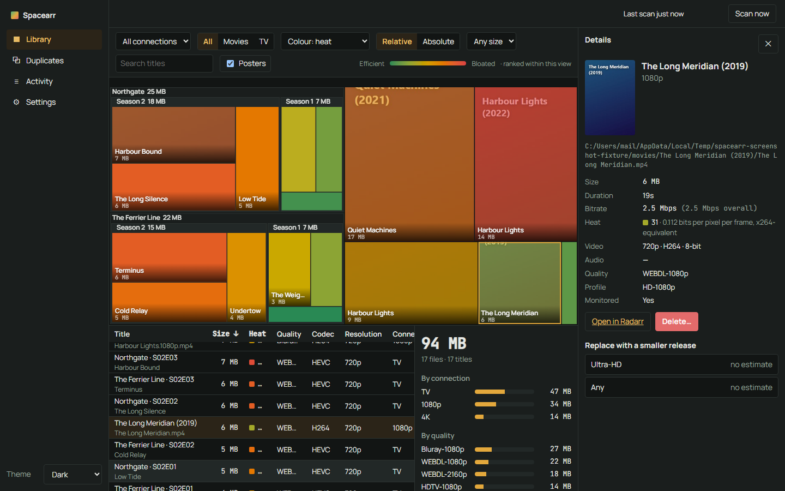
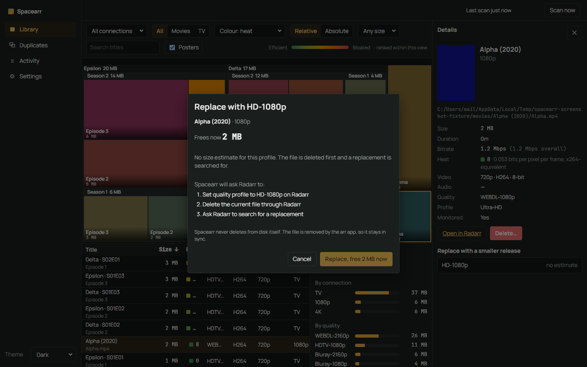
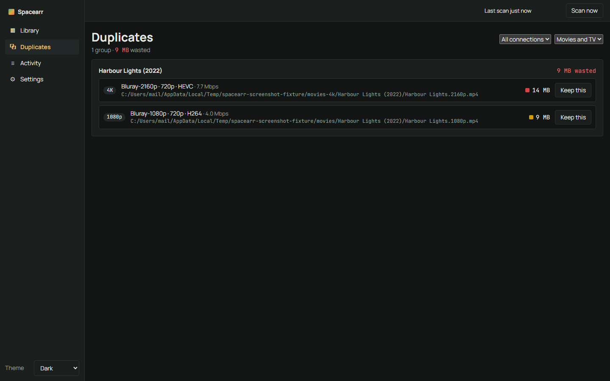
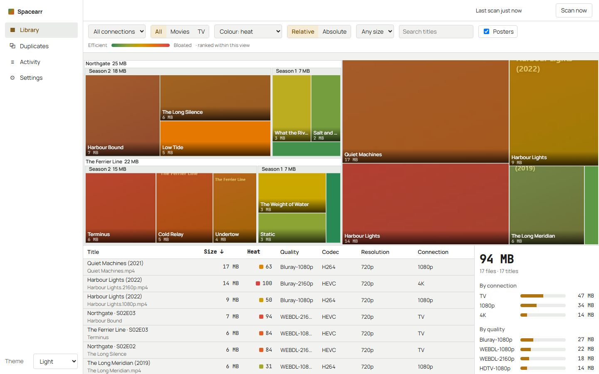

# Spacearr

**The cooler looking WinDirStat for your arr stack.**

Spacearr scans the media library behind Radarr and Sonarr and draws it as a treemap: block size is bytes, colour is bitrate heat. Hover to see what a block is, click to see the file facts, and reclaim space through the arr apps' own APIs. Nothing leaves your network.



## What it does

- **Treemap of your whole library.** Movies as blocks, series → season → episode drill-down, posters under the heat colour on large blocks.
- **Bitrate heat.** Colour by bits per pixel per frame, normalised per codec, so a 6 GB HEVC file and a 12 GB x264 file that look about as good are coloured about the same. Relative mode ranks within your library; absolute mode uses fixed thresholds.
- **Any number of Radarr and Sonarr instances.** The 1080p + 4K two-instance setup is the normal case, and Spacearr shows what it costs.
- **Duplicates across instances**, ranked by wasted bytes, with a keep-this-one action.
- **Two actions, preview first.** Delete, or replace with a smaller release (change the quality profile, delete, search). Every preview lists exactly what will be asked of the arr app and how many bytes it frees. Confirmation only arms after you've seen the preview, and expires after 10 minutes.
- **Nothing leaves your network.** Posters are proxied from your arr app. No fonts, analytics, or update checks call out.

## What it does not do

- It does not transcode. If you want to re-encode files in place, use Tdarr, Unmanic or FileFlows. Spacearr keeps the release and lets the arr app fetch a smaller one.
- It does not delete from disk itself. Deletions go through Radarr's `moviefile` / Sonarr's `episodefile` endpoints, so the arr app's own view of your library stays in sync.
- It does not talk to Plex, Jellyfin or Emby, and it does not know what has been watched. Maintainerr and Janitorr do that.
- It has no rules engine and never acts on its own. Scanning runs on a schedule (default every 6 hours); actions never do. Every action is a person clicking a preview and then a confirm.
- No automatic or scheduled deletions, no bulk replace, no sub-path reverse proxy (root only), no UNC path support on Windows hosts. See [the FAQ](docs/faq.md) for the full list of v1 limits.
- It trusts the URLs you give it for Radarr and Sonarr, including addresses on your own LAN (`http://192.168.1.x`, `http://localhost:...`), and does not try to block or warn on them. That's accepted for v1 - Spacearr assumes you're the one configuring your own instances.
- The poster cache under `/config/posters` is never pruned in v1. It only grows as instances and items change; deleting it is safe (posters are refetched on demand) if disk use ever matters to you.

## Install

### Docker Compose

```yaml
services:
  spacearr:
    image: ghcr.io/zombiez4git/spacearr:latest
    container_name: spacearr
    ports:
      - "8787:8787"
    environment:
      - PUID=1000
      - PGID=1000
      - UMASK=002
      - TZ=Etc/UTC
    volumes:
      - ./config:/config
      # Mount your media with the SAME paths Radarr and Sonarr use, and no path mapping is needed:
      - /path/to/media:/data:ro
    restart: unless-stopped
```

That's `docker-compose.yml` in this repo, verbatim. `docker compose up -d`, then open `http://localhost:8787`. The image is about 395 MB (most of that is ffmpeg, needed for `ffprobe`). The first page creates the admin account; sign-in is required for everything except the version/status check.

Mount your media at the **same path Radarr and Sonarr use** and no path mapping is needed. If the paths differ, the setup wizard suggests a mapping and shows how many files matched.

### From source

Needs the .NET 8 SDK, Node 20, and `ffprobe` (from ffmpeg) on `PATH`.

```bash
cd web && npm ci && npm run build && cd ..
dotnet run --project src/Spacearr
```

A `dotnet build`/`publish` in Release runs `npm ci && npm run build` for you automatically (see `src/Spacearr/Spacearr.csproj`); pass `-p:SkipWeb=true` to skip that and serve whatever is already in `wwwroot` (useful if you've already built the web app, or don't have Node installed). In Debug, `dotnet run` serves a placeholder page unless you've built `web/` yourself first.

## How heat works

`bpp = video bitrate ÷ (width × height × frame rate)`, divided by a codec factor (h264 1.0, HEVC 0.6, AV1 0.5, VP9 0.65, MPEG-2 1.5, VC-1 1.2). Relative mode colours by percentile in the current view; absolute mode maps fixed stops from 0.04 (green) to 0.30 (red). Files ffprobe couldn't read are shown grey, not guessed at. Details in [docs/heat.md](docs/heat.md).

## Screenshots

| Detail and actions | Replace preview |
|---|---|
|  |  |

| Duplicates across instances | Light theme |
|---|---|
|  |  |

## Docs

[Install](docs/install.md) · [Connections and paths](docs/connections-and-paths.md) · [Heat](docs/heat.md) · [Actions](docs/actions.md) · [FAQ](docs/faq.md)

## Security

Authentication is mandatory on every API route except the version/status check and the login/setup endpoints. API keys for your arr apps are encrypted at rest (AES-256-GCM) and never returned by the API. See [SECURITY.md](SECURITY.md) to report a problem.

## Built with AI, reviewed by a person

Spacearr is written with Claude under human direction. Every task ran through an independent AI reviewer pass before being merged, and the maintainer reviews and tags every release. Read [AI-DISCLOSURE.md](AI-DISCLOSURE.md) for how that works and what it means for contributions.

## License

GPL-3.0. Spacearr began as a fork of Radarr and was rebuilt as a standalone service in September 2026; the scanner and arr client code carry that heritage. See [LICENSE](LICENSE).
